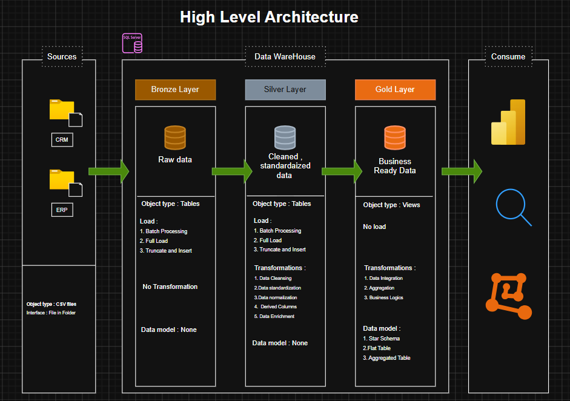
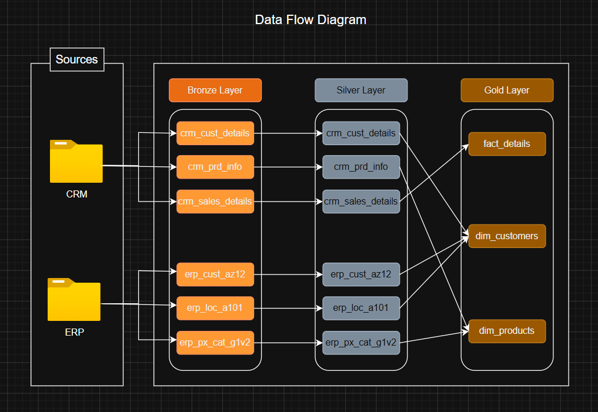
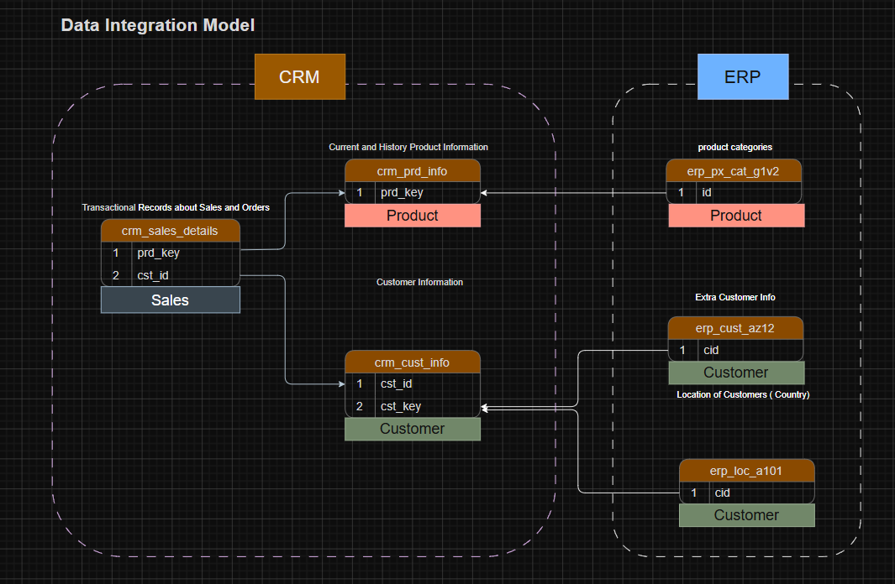
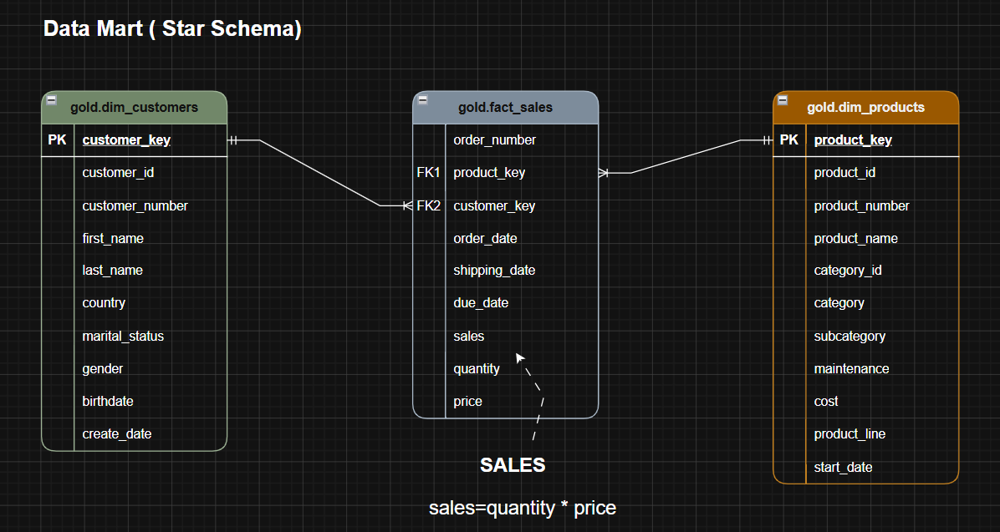

# Data Warehouse and Analytics Project

Welcome to the Data Warehouse and Analytics Project repository! 

This project demonstrates a comprehensive data warehousing and analytics solution, from building a data warehouse to generating actionable insights. Designed as a portfolio project, it highlights industry best practices in data engineering and analytics.

---

## 🏗️ Data Architecture



## Data Flow Diagram



## Data Integration Model



## Data Mart



---

## 📖 Project Overview

This project involves:

- **Data Architecture:** Designing a Modern Data Warehouse Using Medallion Architecture Bronze, Silver, and Gold layers.
- **ETL Pipelines:** Extracting, transforming, and loading data from source systems into the warehouse.
- **Data Modeling:** Developing fact and dimension tables optimized for analytical queries.
- **Analytics & Reporting:** Creating SQL-based reports and dashboards for actionable insights.

---

## 🛠️ Important Links & Tools:


- **[Datasets](https://github.com/unthinkingFool/sql-data-warehouse/tree/main/datasets)**: Access to the project datasets (CSV files).
- **[SQL Server Express:](https://www.microsoft.com/en-us/sql-server/sql-server-downloads)** Lightweight server for hosting your SQL database.
- **[SQL Server Management Studio (SSMS):](https://learn.microsoft.com/en-us/ssms/install/install?view=sql-server-ver16)** GUI for managing and interacting with databases.
- **Git Repository:** Set up a GitHub account and repository to manage, version, and collaborate on your code efficiently.
- **[DrawIO:](https://www.drawio.com/)** Design data architecture, models, flows, and diagrams.
- **[Notion Project Steps:](https://app.notion.com/p/DATA-WAREHOUSE-PROJECT-38879ef02c298026a5dfcb1b85e53e46?source=copy_link)** Access to All Project Phases and Tasks

---

## 🚀 Project Requirements

### Building the Data Warehouse (Data Engineering)

#### Objective

Develop a modern data warehouse using SQL Server to consolidate sales data, enabling analytical reporting and informed decision-making.

#### Specifications

- **Data Sources:** Import data from two source systems (ERP and CRM) provided as CSV files.
- **Data Quality:** Cleanse and resolve data quality issues prior to analysis.
- **Integration:** Combine both sources into a single, user-friendly data model designed for analytical queries.
- **Scope:** Focus on the latest dataset only; historization of data is not required.
- **Documentation:** Provide clear documentation of the data model to support both business stakeholders and analytics teams.

---

### BI: Analytics & Reporting (Data Analysis)

#### Objective

Develop SQL-based analytics to deliver detailed insights into:

- Customer Behavior
- Product Performance
- Sales Trends

These insights empower stakeholders with key business metrics, enabling strategic decision-making.


---

## 📂 Repository Structure

```
data-warehouse-project/
│
├── datasets/                           # Raw datasets used for the project (ERP and CRM data)
│
├── docs/                               # Project documentation and architecture details                
│   ├── DataArchitecture.drawio       
│   ├── data_catalog.md               
│   ├── DataFlowDiagram.drawio              
│   ├── DataIntegrationModel.drawio      
│   ├── DataModel.drawio    
│
├── scripts/                            # SQL scripts for ETL and transformations
│   ├── bronze/                         # Scripts for extracting and loading raw data
│   ├── silver/                         # Scripts for cleaning and transforming data
│   ├── gold/                           # Scripts for creating analytical models
│
├── tests/                              # Test scripts and quality files
│
├── README.md                           # Project overview and instructions
├── LICENSE                             # License information for the repository                  
               
```

---

## 🛡️ License

This project is licensed under the MIT License. You are free to use, modify, and share this project with proper attribution.

---

## 🌟 About Me

Hi there! I'm **Swapnil Das**, currently preparing for interviews and diving deep into the data domain. I work with **AI and Machine Learning**, **Agentic AI workflows**, and **data-driven problem solving**. I'm actively expanding my knowledge in databases, SQL Server, and related topics.

I'm passionate about building my career in **Data Engineering**, **Database Engineering**, or **Machine Learning / AI Engineering**.

Let's stay in touch! Feel free to connect with me on the following platform:

[](https://www.linkedin.com/in/swapnil-das-603824236/)
